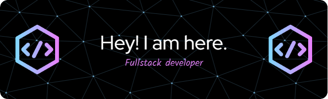

  

  

<!-- Social icons section -->

  
  &#8287;&#8287;&#8287;&#8287;&#8287;
  
  &#8287;&#8287;&#8287;&#8287;&#8287;
  
  &#8287;&#8287;&#8287;&#8287;&#8287;
  

 

<!-- Social badges section -->

  
  
  

  
<h2>✨ This is ME👨‍🎓</h2>

  
🎀I'm a tech enthusiast who loves to use technology to solve real-world business problems. I mean, let's be real, not everyone who types away on a keyboard can call themselves a developer, right?
I also believe that having a great idea doesn't necessarily mean you have a great business idea. You gotta be able to make some moolah out of it! That's where I come in. I'm one of those folks who can turn a brilliant idea into a profitable business venture.🎀

So if you're looking for someone who can bring your tech dreams to life and help you make some serious cash while doing it, then look no further!😀

 
  
<h2>📘 My Latest Projects</h2>

  

    
    
    
  

 
  
<h2>📊 Github Stats and Activity</h2>

<h3>🚀 Github Achivements</h3>

  <h3>🔥 Streak Stats</h3>

  

    
    
🔥 Get streak stats for your profile at <a href="https://git.io/streak-stats">git.io/streak-stats</a>

  

  <h3>💻 GitHub Profile Stats</h3>

 

<b>Note:</b> Top languages is only a metric of the languages my public code consists of and doesn't reflect experience or skill level.

